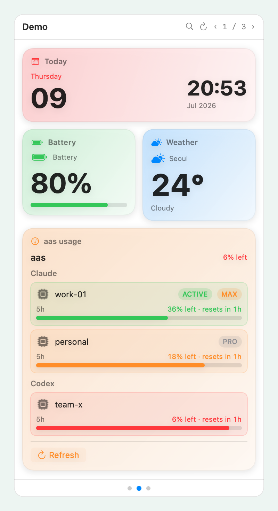

<div align="center">


# BarShelf

**Your menu bar, finally organized.**

One menu bar icon. Every glanceable tool you care about — OTP codes, LLM usage,
recent files, CI status — as native widgets in a single popover.

[](https://www.apple.com/macos/)
[](https://swift.org)
[](https://github.com/Open330/barshelf/releases/latest)
[](Package.swift)
[](LICENSE)

[**Download**](https://github.com/Open330/barshelf/releases/latest) ·
[**Getting Started**](docs/GETTING-STARTED.md) ·
[**Featured Widgets**](docs/widgets/README.md) ·
[**Build a Widget**](docs/WIDGET-SPEC.md) ·
[**Publish**](docs/PUBLISHING.md)



</div>

---

## Why BarShelf

Your most-checked tools are scattered — a dozen menu bar icons, terminal windows,
browser tabs. BarShelf collects them into **one icon, one popover** of native
widgets. Any command-line tool you already have becomes a widget in minutes; no
new SDK to learn.

- **🪟 One icon, many widgets** — bucket pages, trackpad swipe, pinned row, ⌘F search.
- **⚡ CLI is the API** — `aas usage --json`, `otpeek`, `gh`, `kubectl`… pipe them straight in.
- **🎨 Native, not web** — SwiftUI rendering, dark mode, SF Symbols, vibrancy. No Electron.
- **🧩 Three ways to build** — declarative workflows, a Shortcuts-style visual builder, or full scripts.
- **🔒 Permission-gated** — widget capabilities are declared, approved, enforced, and recorded in an audit log.

## Three execution layers, one widget model

Every widget shares the same scheduler, permission frame, and native renderer —
it only differs in where its data comes from:

```
┌────────────────────────────────────────────────────────────────┐
│  exec       manifest declares a CLI → UINode view tree          │
│             (viewtree direct, or data + a builtin adapter)      │
│                                                                  │
│  workflow   declarative JSON DSL — sources → transforms → view  │
│             (${…} interpolation, forEach, fs.directory + QL      │
│              thumbnails, drag-out) — no code                    │
│                                                                  │
│  script     resident Deno subprocess over JSON-RPC + TS SDK     │
│             host-mediated exec / storage / secret / timer       │
└────────────────────────────────────────────────────────────────┘
```

## Quickstart for Agents

<div></div>

```prompt
Install BarShelf on my Mac and scaffold my first widget.

1. Download the latest release from
   https://github.com/Open330/barshelf/releases/latest, unzip the
   BarShelf-<version>-arm64.zip, move BarShelf.app into /Applications, and open it.
   The current v0.1.4 build is Developer ID signed, notarized, and stapled.
2. Download the barshelf CLI — it ships as a separate release asset
   (barshelf-cli-<version>-arm64.tar.gz). Extract it and put barshelf on my PATH.
3. Scaffold a widget:  barshelf new my-widget --kind workflow
   then validate it:   barshelf validate ./my-widget
   then install it:    barshelf install ./my-widget
4. Confirm the widget appears in the menu bar popover.

Requires macOS 13+ on Apple Silicon. Script widgets also need Deno (brew install deno).
```
<div></div>

Copy the prompt above and paste it into your AI agent to install BarShelf and
scaffold a widget. Prefer the manual steps? The human install guide is right below.

## Install

Grab `BarShelf-<version>-arm64.zip` from
**[Releases](https://github.com/Open330/barshelf/releases/latest)**, move it to
`/Applications`, then open it normally. The current v0.1.4 asset is Developer ID
signed, Apple-notarized, and includes a stapled ticket for offline verification.

Full guide, `barshelf` CLI, and troubleshooting: **[docs/INSTALL.md](docs/INSTALL.md)**.

> Requires macOS 13+ on Apple Silicon. Script widgets need [Deno](https://deno.land)
> (`brew install deno`); exec and workflow widgets work without it.

## Gallery widgets

Native widgets ship in the gallery — most are declarative **workflows**
(no code), styled like native macOS/iOS widgets with per-widget color and a
Fit / fixed-height layout. **Today**, **Recent Files**, and the permission-free
**Quick Shelf** are seeded on first run.

| Widget | Source | What it shows |
|---|---|---|
| **Today** · **Calendar** · **Clock** | `/bin/date` | Big date, a month grid with today circled, a live clock — layout adapts to widget size. |
| **Weather** · **Exchange** · **Stock** | http | Temperature, USD→KRW, and a stock quote (Stock needs a `User-Agent` header). |
| **Battery** · **System** · **Network** | shell | Battery %, CPU/Memory/Disk meters, and the local IP. |
| **Recent Files** | `fs.directory` | Stashbar-style Grid/List of recent files — QuickLook thumbnails, drag-out, click to open. |
| **aas Usage** · **OTP Codes** | CLI | LLM usage meters from [`aas`](https://github.com/Open330/aas); TOTP codes with a countdown ring from [`otpeek`](https://github.com/jiunbae/otpeek). |
| **muxa Watch** | CLI + script | Local and SSH-host [`muxa`](https://github.com/Open330/muxa) agents, grouped by host in compact `NAME / ST / ACT / LAST PROMPT` tables. |
| **Downloads** · **GitHub Status** | mixed | Persistence ("new since last check" counting) and an HTTPS status feed. |
| **Quick Shelf** · **Next Meeting** · **Focus Timer** | mixed | A permission-free launcher, your next Calendar event with Join action, and a persistent native countdown. |
| **Project Status** · **Developer Inbox** · **Clipboard Shelf** | script | Git repository state, GitHub review activity, and a privacy-first memory-only clipboard history. |

For **muxa Watch**, enter aliases such as `jiun-mbp, jiun-mini, rtzr` in the
*SSH hosts* setting. It uses your existing `~/.ssh/config` and key-based access
in non-interactive mode; remote hosts need muxa v0.8.18 or newer.

Most native widgets are **clickable** — like a real macOS/iOS widget, clicking the card opens its companion app or page (Today → Calendar, System → Activity Monitor, Stock → Yahoo Finance, Weather → Weather app, …).

## Build a widget in 3 minutes

### Build with an AI agent

Describe the result you want — the agent can discover the BarShelf API, choose
the right execution layer, implement the widget, and validate it. Replace only
the text inside **What I want**, then paste the whole prompt into Codex, Claude
Code, or another coding agent:

```prompt
Build a production-ready BarShelf widget for me.

What I want:
[Describe the information the widget should show, where that data comes from,
what should happen when I click it, and any settings I want. Plain language is
fine. Example: "Show review-requested GitHub PRs, highlight old requests, and
open a PR when clicked. Let me choose how many rows to show."]

First, learn the current BarShelf widget API instead of guessing it:
1. Run `barshelf agent-spec` and treat its output as the source of truth.
2. If that command is unavailable, read `docs/AGENTS.md` in the BarShelf repo:
   https://github.com/Open330/barshelf/blob/main/docs/AGENTS.md
3. For script widgets, inspect the typed SDK in `sdk/mod.ts`:
   https://github.com/Open330/barshelf/blob/main/sdk/mod.ts
4. When relevant, consult `docs/WORKFLOW.md`, `docs/SCRIPT-RUNTIME.md`, the JSON
   schemas under `schema/`, and two similar widgets under `widgets/`.

Then implement it end to end:
- Choose the least-powerful suitable layer: workflow first, exec for a command
  that emits a view tree, and script only for state, timers, or click handlers.
- Create the complete widget directory with `widget.json`, its entry file, and
  a README explaining setup, settings, requirements, and every permission.
- Use only supported UINode types and real SDK helpers. Do not invent APIs.
- Declare the smallest exact permission/command/host allowlist possible. Treat
  private output as sensitive and provide useful empty, setup, and error states.
- Run `barshelf validate <widget-directory>` until it passes. For TypeScript,
  also run `deno check` and `deno fmt --check` with the local BarShelf SDK map.
- Install the local widget with `barshelf install <widget-directory>` after it
  validates, then tell me where it was installed and how to configure it.
- Finish by summarizing the files created, data sources, refresh behavior,
  interactions, settings, permissions, requirements, and verification results.
```

The compact API bundle behind `barshelf agent-spec` is also available as
[the agent authoring spec](docs/AGENTS.md). The [typed SDK](sdk/mod.ts) is the
reference for `barshelf.*`, `ui.*`, `action.*`, storage, secrets, timers,
notifications, and host-mediated command execution. Workflow expressions and
sources are documented in [Workflow DSL](docs/WORKFLOW.md); manifest fields and
native UINode actions are covered by [Widget Spec](docs/WIDGET-SPEC.md).

**Visual builder** — status menu → *Create Widget…* → pick a source (run a
command / watch a folder / static text), a display (list · table · value · text)
with a **live preview**, then name it. No JSON.

**By hand** — a widget is a folder with a `widget.json`:

```jsonc
{
  "$schema": "https://barshelf.jiun.dev/schema/widget-0.1.json",
  "schemaVersion": 1,
  "id": "dev.example.docker-ps",
  "name": "Docker",
  "icon": "shippingbox",
  "bucket": { "group": "Dev", "size": "M" },
  "entry": { "kind": "exec" },
  "source": { "kind": "exec", "command": ["docker", "ps", "--format", "json"], "output": "viewtree" },
  "refresh": { "onOpen": true, "interval": 30 },
  "permissions": { "exec": [{ "command": "docker", "allowedArgs": [["ps", "--format", "json"]] }] }
}
```

Drop it in `~/Library/Application Support/barshelf/widgets/` (hot-reloaded), or
install straight from a repo:

```bash
barshelf install https://github.com/Open330/aas       # GitHub repo
barshelf install ./MyWidget.mbw                        # packed archive
open "barshelf://install?url=…"                   # deep link (README badge)
```

## `barshelf` — the widget CLI

```bash
barshelf new my-widget --kind workflow   # scaffold from a template
barshelf validate ./my-widget            # check manifest + workflow
barshelf pack ./my-widget -o my.mbw      # zip a distributable bundle
barshelf install <url|path>              # install from repo / archive / deep link
barshelf list                            # installed widgets
```

`bsf` is the same CLI as a shorter alias.

Reference: **[docs/CLI.md](docs/CLI.md)**.

## Documentation

| Doc | Contents |
|---|---|
| [Getting Started](docs/GETTING-STARTED.md) | Install, first widget, the bundled examples |
| [Install](docs/INSTALL.md) | Release install, `barshelf`, source build, troubleshooting |
| [Widget Spec](docs/WIDGET-SPEC.md) | `widget.json`, UINode nodes, actions, refresh, permissions |
| [Agents](docs/AGENTS.md) | Self-contained widget-authoring spec for LLM agents (also `barshelf agent-spec`) |
| [Workflow DSL](docs/WORKFLOW.md) | Sources, transforms, interpolation, built-ins, `forEach` |
| [Script Runtime](docs/SCRIPT-RUNTIME.md) | Deno JSON-RPC protocol, `barshelf.*` SDK, sandboxing |
| [Publishing](docs/PUBLISHING.md) | Repo layout, install badges, registry submission |
| [Registry](docs/REGISTRY.md) | The curated gallery index and how to list a widget |
| [CLI](docs/CLI.md) | CLI reference |
| [Privacy](docs/PRIVACY.md) | Local data, widget permissions, network access, support contact |

JSON Schemas: [`widget-0.1.json`](schema/widget-0.1.json) ·
[`uinode-0.1.json`](schema/uinode-0.1.json) ·
[`workflow-0.1.json`](schema/workflow-0.1.json) ·
[`registry-0.1.json`](schema/registry-0.1.json).

## Design principles

- **Zero runtime dependencies** — pure Swift / AppKit / SwiftUI. Deno is optional, script-only.
- **Process isolation is the trust boundary** — third-party widget code never runs in the app process.
- **Declare → approve → enforce** — permissions are shown and approved on first run, then enforced with an audit log.
- **The UI never blanks** — last-good render is always kept; failures show a banner, not an empty popover.

## Build from source

```bash
DEVELOPER_DIR=/Applications/Xcode.app/Contents/Developer swift build   # dev
DEVELOPER_DIR=/Applications/Xcode.app/Contents/Developer swift test    # full test suite
bash scripts/build_app.sh                                              # dist/BarShelf.app + dist/barshelf + dist/bsf
```

The package splits into `MenubucketCore` (models, manifest/workflow parsing,
schedule policy — UI-free, tested) and `MenubucketApp` (AppKit shell, SwiftUI
renderer, runtime), with standalone `barshelf` and `bsf` CLI executable targets.

## License

MIT © Jiun Bae — see [LICENSE](LICENSE).

<div align="center">
<sub>Built with <a href="https://claude.com/claude-code">Claude Code</a></sub>
</div>
