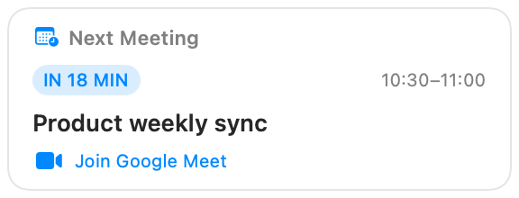
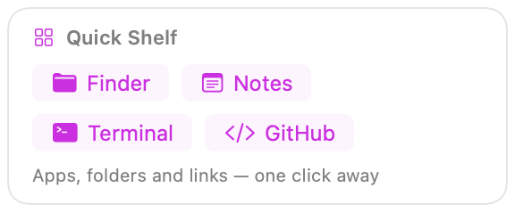
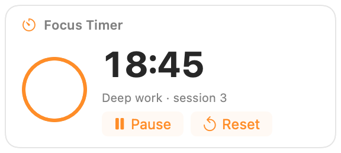
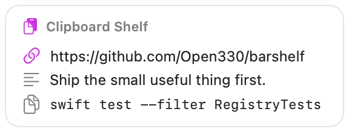
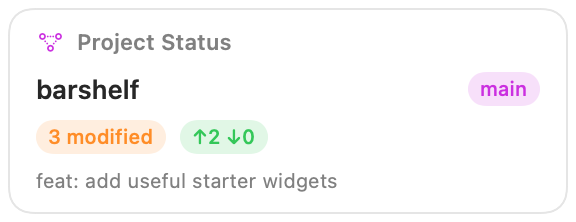
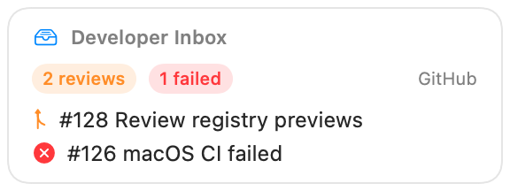

# BarShelf featured widgets

This page is the long-form catalog for the useful widgets bundled with
BarShelf. Every card below is rendered by BarShelf's real native SwiftUI
renderer. Open a widget's README for setup, permissions, and troubleshooting.

## Everyday

### Next Meeting

[](../../widgets/next-meeting/README.md)

See the next Calendar event, when it starts, and its meeting link without
opening Calendar. [Setup and permissions](../../widgets/next-meeting/README.md).

### Quick Shelf

[](../../widgets/quick-shelf/README.md)

Keep frequently used apps, folders, and websites behind one menu-bar icon.
[Setup and customization](../../widgets/quick-shelf/README.md).

### Focus Timer

[](../../widgets/focus-timer/README.md)

Run a persistent focus/break timer with native countdown UI and completion
notifications. [Setup and controls](../../widgets/focus-timer/README.md).

### Clipboard Shelf

[](../../widgets/clipboard-shelf/README.md)

Keep a short, local history of copied text and copy an older item again with
one click. [Privacy model and controls](../../widgets/clipboard-shelf/README.md).

## Developer

### Project Status

[](../../widgets/project-status/README.md)

Glance at a repository's branch, working-tree changes, upstream state, and
latest commit. [Setup and Git requirements](../../widgets/project-status/README.md).

### Developer Inbox

[](../../widgets/developer-inbox/README.md)

Bring review requests and failed GitHub checks into one actionable inbox.
[Setup and GitHub CLI requirements](../../widgets/developer-inbox/README.md).

## Registry presentation metadata

A registry entry can attach both a compact visual preview and a long-form
introduction:

```json
{
  "screenshot": "https://raw.githubusercontent.com/OWNER/REPO/main/assets/widget-preview.png",
  "readme": "https://github.com/OWNER/REPO/blob/main/widgets/my-widget/README.md"
}
```

`screenshot` is shown directly on the Gallery card. When `readme` is present,
the card gets a **Details** action that opens the rendered Markdown page. These
fields are registry presentation metadata; they do not grant widget permissions.
